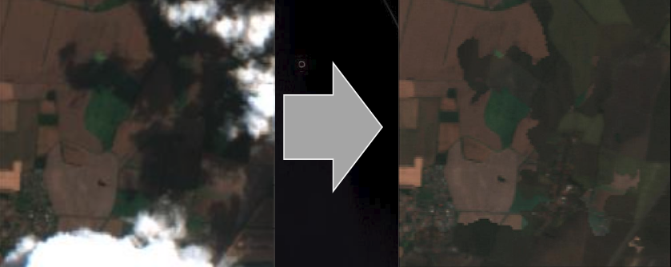
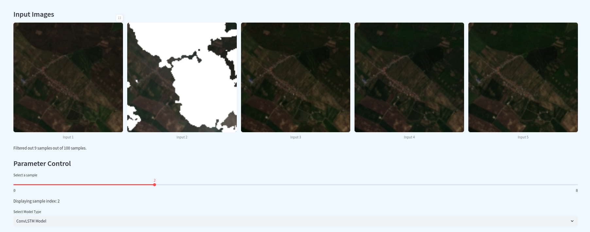
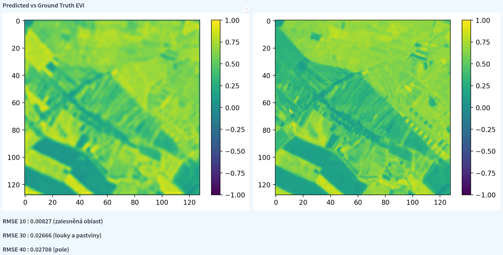

# UnIT competition 2025

This solution won first prize at the UnIT 2025 competition in Prague.   

The task was to develop a method that, given 5 satellite images of the same area, spaced in 5-day intervals, would predict a satellite image 25 days after the last one. Our final model was a custom Convolutional LSTM neural network.

The model has an input of five $128 \times 128$ images, each with 4 channels: red, green, blue, and near infrared (NIR). The prediction is a $128 \times 128$ image with one channel corresponding to the Enhanced Vegetation Index (EVI).

The model is accompanied by a website visualizes the input and prediction of the model.
# Cloud removal

Clouds in satellite images posed a challenge, as they confused the model and reduced the usable data. Due to the unclean dataset, some images contained clouds. We applied a preprocessing algorithm that removes them using approximation methods across selected input images.

# Demonstration
## Input

Above we can see:
1. Five input images 
2. Slider to select batch of images
3. Model selection dropdown

We can notice that the second image is contaminated with clouds.

## Prediction

Above we can see:
1. Prediction on the left
2. Ground truth on the right
3. Evaluation metric for each class at the bottom

# Setup

### 0. Create environment
**Only tested with Python 3.10**. For example, Python 3.13 is unsupported.
For anaconda it would be:

    conda create -n unit2025 python=3.10
##  Web visualization
### 1. Install dependencies
    pip install -r visualization/requirements.txt
### 2. Run 

    make vis

## Training the ConvLSTM
The full training data (~100GB) has to be provided to you by the competition's partner company, Datamole.
### 1. Install dependencies

    pip install -r model/requirements.txt
### 2. Train
    make train

